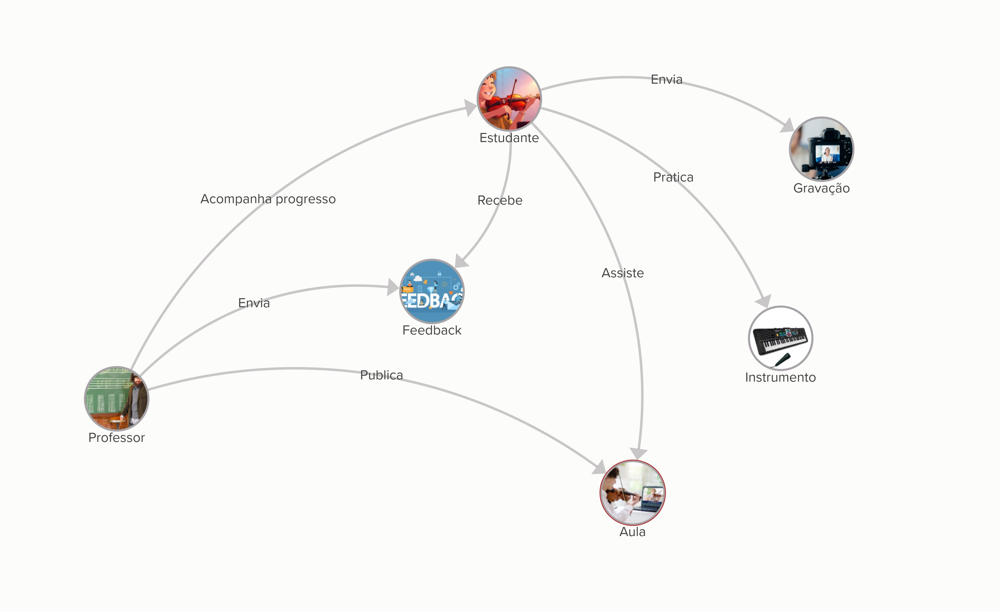
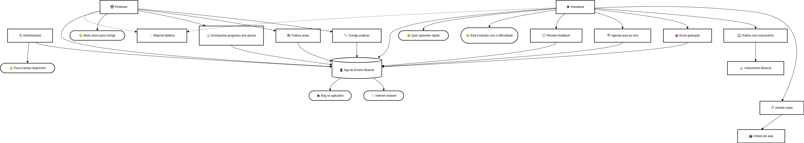

# Rich Picture

## O que é Rich Picture?

O Rich Picture é uma ferramenta visual utilizada na análise de sistemas para representar de forma holística e não estruturada um problema ou situação complexa. Ele permite capturar diferentes perspectivas, stakeholders, processos, fluxos de informação e relacionamentos de forma livre e criativa.

### Características principais:
- Representação visual informal e não técnica
- Permite capturar aspectos "soft" do sistema (emoções, políticas, cultura)
- Facilita a compreensão do contexto geral do problema
- Ajuda a identificar stakeholders e suas interações
- Pode incluir elementos como pessoas, processos, fluxos de dados, problemas e soluções

## Rich Pictures do Projeto

### Rich Picture 1

### Rich Picture 2

## Histórico de Versão
| Versão | Data       | Data de Revisão | Descrição            | Autor(es)                                           | Revisor(es) | Detalhes da revisão |
| ------ | ---------- | --------------- | -------------------- | --------------------------------------------------- | ----------- | ------------------- |
| `1.0`  | 10/04/2025 |                 | Criação do documento | [Lucas Caldas](https://github.com/lucascaldasb) e [Arthur Heleno](https://github.com/arthur-heleno) |      [Arthur Sousa](https://github.com/arthurrsousa)       |                     |