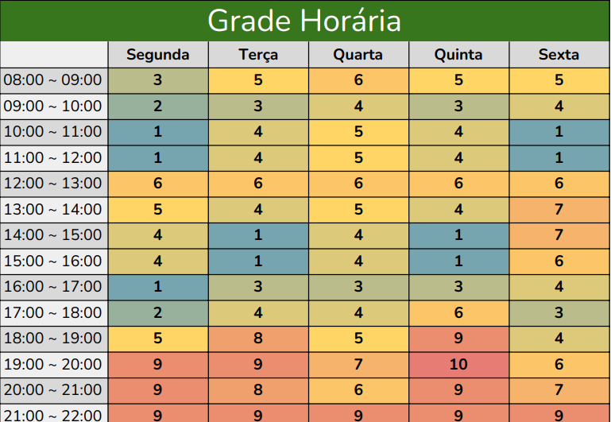

# 1.2.7 Heatmap de Disponibilidade

## 1. Introdução

Durante as etapas iniciais do projeto, a organização das reuniões foi um fator essencial para garantir o alinhamento entre os membros e a eficiência do trabalho em equipe. Pensando nisso, a equipe utilizou um Heatmap de Disponibilidade com o objetivo de mapear os horários mais viáveis para a realização de reuniões semanais.

Essa abordagem foi adotada para facilitar a escolha dos melhores momentos para encontros remotos e, assim, evitar conflitos de agenda. O Heatmap permitiu visualizar de maneira clara os períodos em que havia maior convergência entre as disponibilidades dos integrantes.

## 2. Metodologia

A construção do Heatmap foi feita de forma colaborativa, com cada membro da equipe preenchendo uma planilha compartilhada com seus horários disponíveis ao longo da semana. Os dados foram compilados e organizados visualmente através de um mapa de calor (heatmap), destacando os períodos com maior concentração de disponibilidade.

Essa representação visual auxiliou na definição dos horários fixos para as reuniões do grupo, garantindo uma comunicação contínua e produtiva entre os participantes desde o início do projeto.

Ferramentas utilizadas:
- [Google Sheets](https://www.google.com/sheets/about/) para coleta dos dados de disponibilidade.
- [Discord](https://discord.com/) para realização das reuniões semanais.

## 3. Heatmap de Disponibilidade

<figure markdown>
  
<b>Imagem 01</b> - Heatmap de Disponibilidade Semanal

  

  

    Fonte: [Amanda Abreu](https://github.com/Amandaaaaabreu), 
    [Enrico Martins Mantoan Zoratto](https://github.com/sidts), 
    [Esther Silva Cardoso de Sousa](https://github.com/esthersousa), 
    [Laís Cecília Soares Paes](https://github.com/Laisczt), 
    [Pedro Lucas Dourado Santos](https://github.com/lucasdray), 
    [Pedro Lucas Santana](https://github.com/pedrolucas12), 
    [Sebastián Héctor Zuzunaga Rosado](https://github.com/sebazac332), 
    [Lucas Caldas Barbosa de Souza](https://github.com/lucascaldasb)
  

</figure>

## 4. Conclusão

O uso do Heatmap de Disponibilidade foi fundamental para a organização do grupo durante a fase inicial do projeto. Através dessa visualização, foi possível definir com clareza os melhores horários para as reuniões, promovendo maior engajamento, pontualidade e participação dos membros.

Esse tipo de ferramenta se mostrou simples, mas altamente eficaz, permitindo que o grupo se concentrasse em discussões produtivas desde o início, sem perder tempo com ajustes de agenda. A adoção de práticas como essa contribui para uma melhor gestão do tempo e maior coesão da equipe ao longo do projeto.

## 5. Referencias

> <a id="#REF1" >1.</a> ATLASSIAN. A complete guide to heatmaps. Atlassian, [s.d.]. Disponível em: https://www.atlassian.com/data/charts/heatmap-complete-guide​. Acesso em: 10 abr. 2025.

## 6. Histórico de Versão
| Versão | Data       | Data de Revisão | Descrição            | Autor(es)                                           | Revisor(es) | Detalhes da revisão |
| ------ | ---------- | --------------- | -------------------- | --------------------------------------------------- | ----------- | ------------------- |
| `1.0`  | 10/04/2025 |                 | Criação do documento | [Pedro Lucas Dourado](https://github.com/lucasdray) |             |                     |