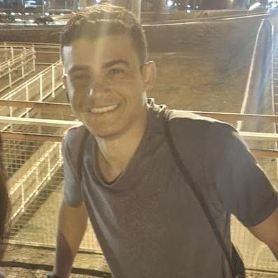
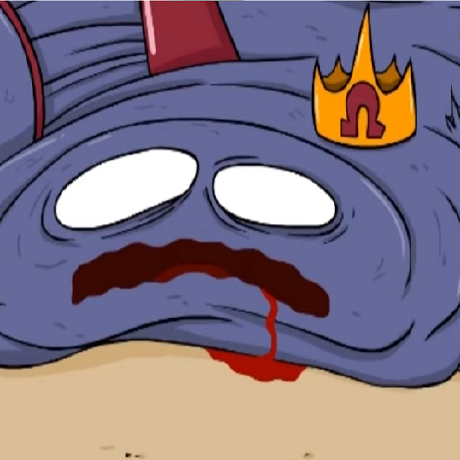
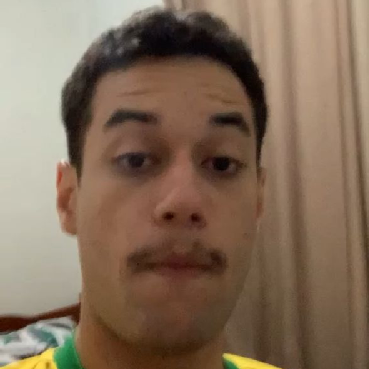

# Mundo Musical

**Código da Disciplina**: FGA0208 
**Número do Grupo**: 05 
**Entrega**: 01 

## Alunos

|Foto| Nome |
|--|--|
||[Amanda Abreu](https://github.com/Amandaaaaabreu)
||[Arthur Heleno](https://github.com/arthur-heleno)
||[Arthur Sousa](https://github.com/arthurrsousa)
||[Enrico Zoratto](https://github.com/sidts)
||[Esther Sousa](https://github.com/esthersousa)
||[Laís Soares](https://github.com/Laisczt)
||[Lucas Caldas](https://github.com/lucascaldasb)
||[Pedro Lucas Dourado](https://github.com/lucasdray)
||[Pedro Lucas Santana](https://github.com/pedrolucas12)
||[Sebastián Rosado](https://github.com/sebazac332)

## Sobre 

O Mundo Musical é uma plataforma de aprendizado de teoria musical de forma gamificada, com o objetivo de fornecer uma maneira símples e engajante para usuários iniciantes aprenderem os básicos, e usuários mais avançados praticarem onde quer que estejam.

Utilizando jogos símples e quizes, além de gráficos amigáveis, o aprendizado pelo Mundo Musical é mais divertido e menos intimidador do que formas tradicionais de aprender música. Sistemas de recompensa por prática diária e um elemento competitivo opcional incentivam o uso regular da plataforma para um melhor aprendizado.

## Screenshots da Primeira Entrega
Adicione 2 ou mais screenshots em termos de artefatos realizados na entrega.

## Há algo a ser executado?

( ) SIM

(X) NÃO

## Informações Complementares 
Quaisquer outras informações adicionais podem ser descritas nessa seção.

## Histórico

|Versão|Descrição|Autor(es)|Data|Revisor(es)|Data de revisão|
|------|---------|---------|----|-----------|---------------|
| 1.0  | Nomes dos participantes adicionados ao templete | Laís Soares | 07/04/2025 | ||
| 1.1  | Resto do template preenchido | Laís Soares | 10/04/2025 | ||
